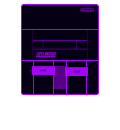

# ROMeo — Entertainment Organizer

> A DAT-first ROM library manager for macOS. Scan your collection, verify against No-Intro databases, and export clean, properly-named libraries to any retro device.



---

## What it does

ROMeo is built around a **Pokédex model**: the DAT catalog defines every known game, and scanning matches your ROM files against it by CRC32 checksum — never by filename. This means:

- Every game is identified by its actual content, not its name
- Regional variants (USA/Japan/Europe) are grouped under the correct parent game
- Clean DAT names are always used — no `004 - ` prefixes or dirty filenames in exports
- One-game/one-ROM deduplication uses the DAT's own clone relationships, not fuzzy string matching

---

## Quick Start

```bash
# 1. Clone
git clone https://github.com/YOUR_USERNAME/romeo
cd romeo

# 2. Install dependencies (Python 3.10+)
pip3 install -r requirements.txt

# 3. Run
python3 server.py
```

Browser opens automatically at **http://localhost:7777**

---

## First Run

1. **DAT Files** tab → *Download Available DATs* (auto-downloads No-Intro databases via libretro-database)
   — or — *Import DAT File* to load any No-Intro `.dat` or `.zip` from [datomatic.no-intro.org](https://datomatic.no-intro.org) — console is detected automatically
2. **Scan** tab → point at your ROM folder → *Start Scan* (progress shown in sidebar)
3. **Library** tab → browse your collection by letter, filter by console, see which variants you own
4. **Export** tab → choose a device profile, set SD capacity, filter by console → export clean, renamed ROMs

---

## Features

### DAT-first catalog
- CRC32-based identification — filename irrelevant
- Groups regional variants using DAT `cloneofid` parent relationships
- Strips release number prefixes (`0001 - `, `004 - `) from all output names
- Auto-detects console from DAT file header on import

### Library
- Pokédex-style view: every known game, showing which you own
- Letter bar + search + console filter
- Shows all regional variants per game with collection status
- Alphabetical, clean display names (USA preferred)

### Export
- Device profiles: **Miyoo Mini**, **Miyoo Mini+**, **Anbernic**, **RetroPie**, **Batocera**, flat, by-console
- One-game / one-ROM mode (best region + highest revision per game)
- Skip bad dumps (Proto, Beta, Demo, Hack, Unlicensed)
- SD card capacity planner with per-console size breakdown
- Auto-fit: selects which consoles fit your SD size
- Exports manifest JSON for tracking

### Other
- Safe trash (internal, reversible) — nothing deleted permanently
- Recent scan history
- Rebuild catalog without re-scanning ROMs
- Light / dark theme toggle (preference saved)
- Cyber Onion Atomic visual theme with console pixel-art icons

---

## Supported Consoles

| Console | Auto-download | Icons |
|---------|:---:|:---:|
| NES / Famicom | ✓ | ✓ |
| SNES / Super Famicom | ✓ | ✓ |
| Game Boy | ✓ | ✓ |
| Game Boy Color | ✓ | ✓ |
| Game Boy Advance | ✓ | ✓ |
| Nintendo DS | | ✓ |
| Nintendo 64 | | |
| GameCube | ✓ | |
| Wii | ✓ | |
| PlayStation 1 | | ✓ |
| PlayStation 2 | | |
| PSP | | |
| Dreamcast | | |
| Saturn | ✓ | |
| Genesis / Mega Drive | | ✓ |
| Master System | | ✓ |
| Game Gear | | ✓ |
| PC Engine | | ✓ |
| WonderSwan | | ✓ |
| Neo Geo | ✓ | ✓ |
| Atari 2600 | | ✓ |
| Atari 7800 | | ✓ |
| Atari Lynx | | ✓ |
| FDS | | ✓ |
| PICO-8 | ✓ | ✓ |
| MAME / Arcade | | ✓ |
| Vectrex | | ✓ |

Any No-Intro DAT can be manually imported — console is detected automatically from the file header.

---

## Project Structure

```
romeo/
├── server.py          # Flask app — all API routes
├── core/
│   ├── db.py          # SQLite schema, catalog queries, export queries
│   ├── scanner.py     # CRC32 scanner, region/revision/bad-tag detection
│   ├── dats.py        # DAT download, parse (XML + ClrMamePro), cache
│   └── fileops.py     # Safe trash, export copy, device folder maps
├── static/
│   ├── css/app.css    # Cyber Onion Atomic theme
│   ├── js/
│   │   ├── api.js     # Fetch wrapper
│   │   ├── views.js   # All view renderers
│   │   └── app.js     # Navigation, stats, theme toggle
│   ├── icons/         # Console pixel-art icons (Cyber Onion Atomic)
│   └── fonts/         # Unispace font
└── requirements.txt
```

---

## Tech Stack

- **Backend**: Python 3, Flask, SQLite
- **Frontend**: Vanilla JS, CSS custom properties — no framework, no build step
- **DAT sources**: [No-Intro](https://no-intro.org) via [libretro-database](https://github.com/libretro/libretro-database)
- **Icons / theme**: [Cyber Onion Atomic by Aemiii91](https://github.com/OnionUI/Themes)

---

## Roadmap

- [x] v0.1 — Core scan + dedup + export
- [x] v0.2 — DAT-first catalog, CRC32 matching, Pokédex library view
- [x] v0.3 — Cyber Onion theme, console icons, auto-detect DAT import, light/dark toggle
- [ ] v0.4 — Box art scraping (ScreenScraper API)
- [ ] v0.5 — M3U playlist generation for multi-disc games
- [ ] v0.6 — Windows support

---

## License

MIT
